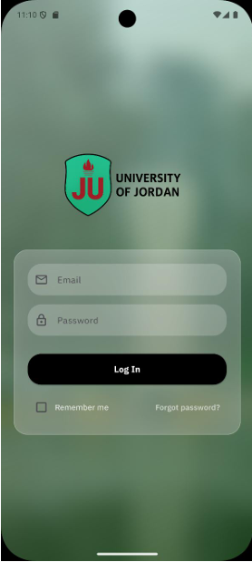
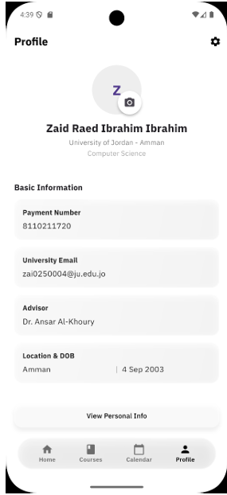
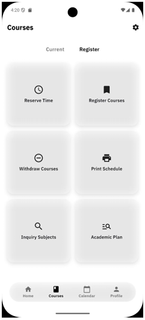
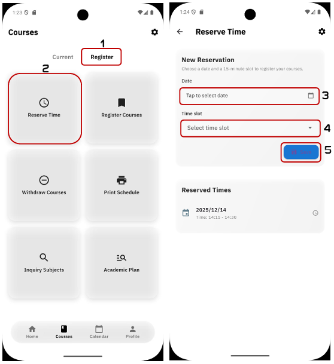
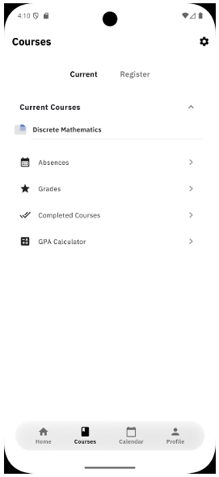

<div align="center">


# UNiGO — University Academic Companion

**A unified mobile platform for managing every aspect of student academic life.**

[](https://flutter.dev)
[](https://dart.dev)
[](https://firebase.google.com)
[](https://github.com/Lynnadel/UNiGO-main)
[](https://github.com/Lynnadel/UNiGO-main)

</div>

---

## Table of Contents

- [About the Project](#about-the-project)
- [Screenshots](#screenshots)
- [Features](#features)
- [Architecture](#architecture)
- [Tech Stack](#tech-stack)
- [Database Design](#database-design)
- [User Roles](#user-roles)
- [Getting Started](#getting-started)
- [Installation](#installation)
- [Security](#security)
- [Testing](#testing)
- [Future Work](#future-work)
- [Team](#team)

---

## About the Project

University students are often forced to juggle multiple disconnected platforms — one for course registration, another for grades, yet another for assignments. This fragmentation leads to confusion, missed deadlines, and a frustrating academic experience.

**UNiGO** solves this by bringing every essential academic service into a single, secure, mobile-first application. Built with Flutter and powered by Firebase, it delivers a real-time, responsive experience across Android and iOS.

> Developed as a graduation project at the **King Abdullah II School of Information Technology, University of Jordan**, under the supervision of **Dr. Ansar Al-Khoury**.

---

## Screenshots

<div align="center">

| Login | Courses (Current) | Courses (Register) | Reserve Time | Profile |
|:---:|:---:|:---:|:---:|:---:|
|  |  |  |  |  |

</div>

> The app features a clean white/light-grey design with a bold navigation bar. Student accounts are provisioned by administrators — there is no self-registration.

---

## Features

### Student Interface

| Feature | Description |
|---|---|
| **Secure Login** | Email/password authentication via Firebase Auth with role-based routing |
| **Home Dashboard** | Quick-access shortcuts and current semester course overview |
| **Course Registration** | Reserve a time slot, register for upcoming semester courses, and withdraw before the deadline |
| **Course Content** | Access downloadable PDF materials and announcements per course |
| **Grades & Absences** | View assessment scores and attendance records per course |
| **GPA Calculator** | Track current and historical GPA |
| **Academic Plan** | Monitor completed credit hours and progress toward degree requirements |
| **Calendar** | Unified view of global university events, course deadlines, and personal reminders |
| **Personal Reminders** | Add local device notifications for your own schedule |
| **Print Schedule** | Export and print weekly timetable as a PDF |
| **Profile Management** | Update personal info and profile photo (stored in Firebase Storage) |
| **Push Notifications** | FCM-powered alerts for registration periods, deadlines, and announcements |

### Admin Interface (Professors / Academic Staff)

| Feature | Description |
|---|---|
| **Course Dashboard** | Manage assigned courses |
| **Material Publishing** | Upload PDF course materials to Firebase Storage |
| **Announcements** | Post course-level announcements in real time |
| **Student Records** | View and update grades and absences per student |
| **Calendar Management** | Create and manage course-scoped events and deadlines |

### Super Admin Interface

| Feature | Description |
|---|---|
| **Controlled User Creation** | Create student/admin accounts linked to civil registry data, with auto-generated sequential University IDs |
| **Role Management** | Assign and modify roles (student, admin, superAdmin) |
| **Course & Faculty Management** | CRUD for courses, faculties, majors, and sections |
| **Academic Staff Management** | Manage professor profiles and course assignments |
| **Global Registration Window** | Open/close registration system-wide with a defined time range |
| **Per-Student Registration Windows** | Assign individual start/end times for each student |
| **System-Wide Calendar** | Create global events visible to all students |

---

## Architecture

UNiGO follows a **layered architecture** with clear separation between UI, controllers (ChangeNotifier), and services:

```
lib/
├── main.dart               # App entry, AuthRoleGate, MainScaffold (IndexedStack)
├── controllers/            # ChangeNotifier controllers per feature module
│   ├── calendar_controller.dart
│   ├── registration_controller.dart
│   ├── profile_controller.dart
│   └── ...
├── services/               # Cross-cutting services
│   ├── registration_service.dart
│   ├── push_notifications_service.dart
│   ├── reminder_notifications_service.dart
│   └── super_admin_user_management_service.dart
├── pages/
│   ├── student/            # Student-facing screens
│   ├── admin/              # Admin-facing screens
│   └── super_admin/        # Super Admin screens
└── widgets/                # Shared UI components
```

**Navigation** is implemented using a bottom `IndexedStack` (4 tabs: Home, Courses, Calendar, Profile) to preserve state across tab switches.

**Role Gating** is enforced at startup via `AuthRoleGate`, which reads `roles/{uid}.role` from Firestore and routes to the correct root interface.

---

## Tech Stack

| Layer | Technology |
|---|---|
| **UI Framework** | Flutter (Dart) |
| **State Management** | Provider / ChangeNotifier |
| **Authentication** | Firebase Authentication (email/password) |
| **Database** | Cloud Firestore (NoSQL) |
| **File Storage** | Firebase Storage |
| **Push Notifications** | Firebase Cloud Messaging (FCM) |
| **Local Notifications** | `flutter_local_notifications` + `timezone` |
| **Email Delivery** | Firestore "Send Email" Extension |
| **Background Logic** | Cloud Functions |
| **PDF Export** | `pdf` + `printing` packages |
| **File Upload** | `file_picker` |
| **Fonts** | IBM Plex Sans (Regular, Medium, SemiBold, Bold) |
| **Version Control** | GitHub |

**Key Flutter Dependencies:**

```yaml
cloud_firestore: ^6.0.2
firebase_auth: ^6.1.0
firebase_messaging: ^16.0.0
firebase_storage: ^13.0.5
provider: ^6.1.5+1
table_calendar: ^3.2.0
flutter_local_notifications: ^17.2.3
pdf: ^3.11.0
printing: ^5.12.0
file_picker: ^8.0.0
flutter_secure_storage: ^9.2.4
shared_preferences: ^2.2.3
google_fonts: ^6.3.1
url_launcher: ^6.3.0
```

---

## Database Design

UNiGO uses **Cloud Firestore** as its primary store, **Firebase Authentication** for identity, and **Firebase Storage** for file assets.

### Top-Level Collections

| Collection | Purpose |
|---|---|
| `users/{uid}` | Student/admin profile + academic state (enrolled courses, GPA, etc.) |
| `roles/{uid}` | Authorization role (`student`, `admin`, `superAdmin`) |
| `civilRegistry/{nationalId}` | Source-of-truth records used during controlled account creation |
| `courses/{courseCode}` | Course catalog — title, credits, faculty, prerequisites, sections |
| `faculties/{facultyId}` | Faculty metadata with `majors` and `professors` sub-collections |
| `calendarEvents/{eventId}` | Unified calendar: global events, course deadlines, personal reminders |
| `registrationWindows/{uid}` | Per-student registration time slots |
| `config/registration` | Global registration open/close state and time window |
| `counters/universityId` | Atomic counter for sequential University ID generation |
| `mail/{docId}` | Outgoing email queue (Send Email extension) |
| `deletedUsers/{docId}` | Lightweight audit log for deleted accounts |

### Key Sub-Collections

```
users/{uid}/courses/{courseCode}
  ├── grades/{gradeId}          # Assessment items (score, maxScore, confirmed)
  └── absences/{absenceId}      # Absence sessions (date, time)

users/{uid}/fcmTokens/{token}   # Device push notification tokens

courses/{courseCode}/materials/{materialId}      # PDF materials (url, storagePath)
courses/{courseCode}/announcements/{announcementId}

faculties/{facultyId}/majors/{majorId}
faculties/{facultyId}/professors/{uid}
```

### Firebase Storage Paths

```
profile_photos/{uid}/{timestamp}.{ext}
course_materials/{courseCode}/{materialId}_{filename}
```

---

## User Roles

UNiGO has three distinct roles, each with its own interface and permissions:

```
Student
  └── Can: view courses, register, check grades, manage calendar, print schedule

Admin (Professor)
  └── Can: manage course materials, post announcements, update grades/absences, create events

Super Admin
  └── Can: everything above + create users, manage roles, configure registration, manage faculty/courses
```

Account creation is **administrator-controlled** — students do not self-register. The Super Admin creates accounts via civil registry lookup, which generates a university email and sequential ID automatically.

---

## Getting Started

### Prerequisites

- Flutter SDK `^3.9.2`
- Dart SDK `^3.9.2`
- Android Studio or VS Code with Flutter plugin
- A Firebase project (see Firebase Setup below)
- Android device or emulator running Android 8.0+

### Clone the Repository

```bash
git clone https://github.com/Lynnadel/UNiGO-main.git
cd UNiGO-main
flutter pub get
```

---

## Installation

### 1. Firebase Setup

1. Create a new project at [console.firebase.google.com](https://console.firebase.google.com)
2. Enable **Authentication** (Email/Password provider)
3. Enable **Cloud Firestore** and deploy the included `firestore.rules`
4. Enable **Firebase Storage**
5. Enable **Firebase Cloud Messaging**
6. Install the **Firestore Send Email** extension for transactional emails
7. Download `google-services.json` (Android) and place it in `android/app/`
8. Download `GoogleService-Info.plist` (iOS) and place it in `ios/Runner/`

```bash
# Deploy Firestore security rules
firebase deploy --only firestore:rules
```

### 2. Cloud Functions (optional — for FCM fan-out)

```bash
cd functions
npm install
firebase deploy --only functions
```

### 3. Run the App

```bash
# Debug on connected device or emulator
flutter run

# Build release APK
flutter build apk --release
```

### 4. Initial Data Setup

Create the first Super Admin account directly in Firebase Authentication, then add the corresponding documents:

```
# In Firestore:
users/{uid}: { fullName: "...", email: "...", ... }
roles/{uid}: { role: "superAdmin" }
```

The Super Admin can then create all other users via the in-app flow.

---

## Security

UNiGO applies a **security-by-design** approach across both client and backend layers:

- **Firebase Authentication** manages all credentials — passwords are never stored or handled by the app
- **Firestore Security Rules** enforce server-side access control: students can only read/write their own data; admins are scoped to their assigned courses
- **Storage Rules** restrict file access based on role and course enrollment
- **Role Gating** at the client routes users to the correct interface after login
- **Fail-safe defaults**: if configuration documents (e.g., `config/registration`) are missing or malformed, the app defaults to the most restrictive behavior (registration closed)
- **Atomic ID generation**: sequential University IDs are generated using Firestore transactions to prevent collisions
- **Data validation**: all controller inputs are validated before writes to Firestore

---

## Testing

Testing was conducted across four levels:

1. **Smoke Testing** — app starts, routes correctly, no crash on launch
2. **Functional Testing** — all role-based workflows validated end-to-end
3. **Integration Testing** — Firestore, Storage, FCM, and Cloud Functions behaviors verified
4. **Usability Testing** — Heuristic Evaluation (Nielsen's 10 heuristics) and Cooperative Evaluation with real users

Key results:
- 90%+ of test users completed core tasks without external assistance
- App response time under 2 seconds for all main interactions
- Heuristic evaluation identified and resolved issues in loading feedback, error messaging, and navigation clarity

---

## Future Work

- **AI Course Suggestion** — recommend courses based on GPA, prerequisites, and history
- **QR Code Attendance** — students scan instructor-generated QR codes to mark attendance
- **Interactive Campus Map** — locate buildings, labs, and facilities
- **Augmented Reality Navigation** — AR-guided wayfinding on campus
- **Study Groups** — create and join study groups per course
- **Chatbot Assistant** — in-app AI answers to common student questions
- **Dark Mode** — full dark theme support
- **iOS Full Release** — expand testing and distribution to iOS


<div align="center">

Built with ❤️ at the University of Jordan 

</div>
